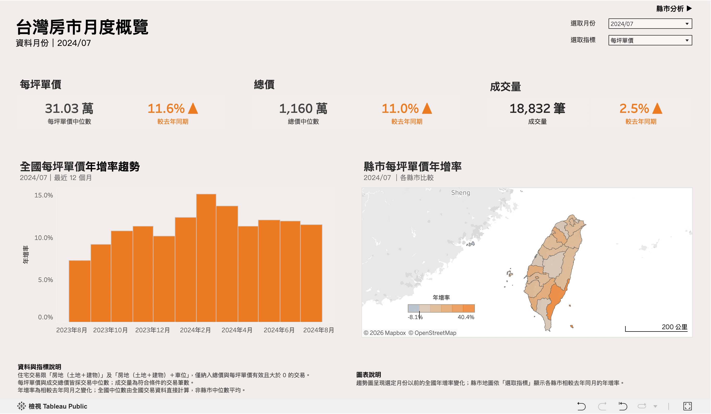
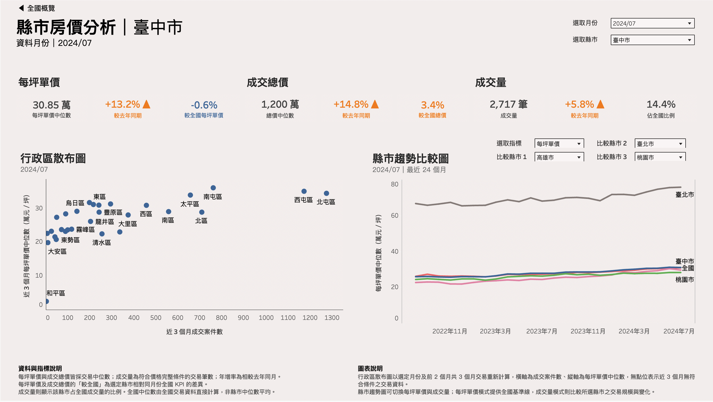

# Taiwan Real Estate Dashboard

以 2012–2024 年台灣實價登錄資料為基礎，建立一條可重現、可對帳的資料流程，將大型 Stata 原始檔轉換成 PostgreSQL 分析資料集，再以 Tableau 呈現全台、縣市與行政區房市變化。

這個專案不只展示儀表板，也展示資料剖析、清理契約、批次追蹤、資料倉儲建模、增量更新與發布驗證如何共同支撐可信的分析結果。

[開啟 Tableau Public 互動式 Dashboard](https://public.tableau.com/app/profile/tsungmi.lin/viz/housing_portfolio/sheet17)

## 專案現況

| 項目 | 目前狀態 |
|---|---|
| 階段 | 作品集 v1 完成 |
| 資料流程 | Python 清理、Parquet 檢查點與 PostgreSQL 三層模型已完成 |
| Tableau | 兩個 Dashboard 已完成，可攜版已通過離線操作驗收 |
| 已驗證資料 | 原始 4,380,208 筆；清理後 4,261,466 筆 |
| 分析發布期間 | 2012-08 至 2024-07 |
| 自動化驗證 | 71 個一般測試與 4 個 PostgreSQL 端到端測試通過 |

目前資料快照、已完成成果與後續發展方向記錄在 [專案進度](docs/project-status.md)。

## Tableau 成果

公開交付物為 `housing_portfolio.twbx`，其中已內嵌 Tableau Hyper extract，可直接離線檢視。開發與資料更新時另以 PostgreSQL 即時連線驗證；該本機工作版本不隨公開專案提供。

可攜版只內含三張分析表與行政區維度，不包含逐筆交易事實表、原始資料或清理後 Parquet。它與通過驗證的即時開發版本具有相同頁面、計算欄位、控制項與預設狀態。

Dashboard 分為兩頁：

| 頁面 | 回答的問題 | 主要呈現 |
|---|---|---|
| 台灣房市月度概覽 | 選定月份的全台市場水準與區域動能如何？ | 全台 KPI、近 12 個月年增率、縣市年增率地圖 |
| 縣市房價分析 | 指定縣市相對全國與其他縣市的表現如何？ | 縣市 KPI、24 個月趨勢、行政區近三個月散布圖 |

### Dashboard 預覽

#### 台灣房市月度概覽



#### 縣市房價分析



KPI 母體、公式、控制項及畫面設計見 [分析指標與 Tableau Dashboard](docs/analytics-dashboard.md)。

## 資料流與系統架構

```text
原始 Stata `.dta`
        │
        ▼
Python 分批剖析、清理與驗證
        │
        ├── transactions_clean.parquet
        ├── transactions_excluded.parquet
        └── cleaning audit
        │
        ▼
PostgreSQL
├── staging    接收、UPSERT 與批次對帳
├── core       一致化交易事實與維度
└── analytics  Tableau 使用的月度與移動窗口 KPI
        │
        ├── PostgreSQL 即時連線      本機開發與更新驗證
        └── housing_portfolio.twbx    內嵌 Hyper 的公開可攜版
```

| 資料層 | 核心責任 |
|---|---|
| 原始資料 | 保存不可變來源，不隨公開專案提供 |
| 清理與 Parquet | 決定納入／排除、標準化欄位並保存可重建檢查點 |
| `staging` | 載入清理後資料、保存批次狀態與月份變更 |
| `core` | 保存可重用的交易事實與一致化維度 |
| `analytics` | 依 Tableau 需求產生全國、縣市與行政區 KPI |
| Tableau | 負責互動、視覺層級與敘事，不重新定義資料規則 |

完整元件、資料邊界與批次追蹤方式見 [技術規格](docs/technical-spec.md)。

## 分析口徑摘要

清理後資料保留房地、房地＋車位與土地三種交易；Dashboard 的房屋 KPI 只分析前兩者，避免把土地和房屋價格混為同一市場。

單價、總價與案件數使用同一批「總價與單價皆為有效正值」的交易。每筆交易等權，中位數由符合條件的逐筆交易直接計算，不平均月中位數或縣市中位數。「成交量」在畫面上代表價格完整交易紀錄數，不等同官方建物所有權買賣移轉棟數。

精確排除規則與欄位語意見 [資料清理與欄位契約](docs/data-contract.md)；KPI 公式與時間規則見 [分析指標與 Tableau Dashboard](docs/analytics-dashboard.md)。

## 資料來源

目前版本使用由內政部地政司實價登錄資料整理而成的固定 DTA 快照，再由本專案重新清理、對帳與聚合；它不是本專案直接下載的 MOI 原始批次檔。原始檔、逐筆清理結果與本機資料庫都不隨公開專案提供。

公開內容可重現資料處理方法、測試與系統設計，但不包含建立目前快照所用的 DTA。若沒有欄位相容的來源檔，無法精確重建目前的資料筆數與 Tableau 快照。

MOI 官方查詢服務目前於每月 1、11、21 日更新，當期批次資料可由官方 Open Data 下載。來源入口、資料時間差與未來換源規劃見 [資料來源與未來更新](docs/data-sources.md)。

## 專案結構

```text
data/reference/        版本化行政區參照資料
docs/                  架構、契約、操作、指標、決策與進度
profiling_output/      可公開的資料剖析彙總
sql/                   staging、core、analytics DDL 與更新 SQL
src/                   Python 剖析、清理、載入與流程協調器
tests/                 單元、流程與一次性 PostgreSQL 整合測試
housing_portfolio.twbx Tableau 可攜版
台灣房市月度概覽.png    作品集概覽頁截圖
縣市房價分析.png        作品集縣市頁截圖
```

原始資料、清理後 Parquet、稽核輸出、環境設定與本機資料庫不包含在公開專案中。

## 建議閱讀順序

第一次接觸專案時，依下列順序即可由淺入深理解；不需要一開始閱讀完整欄位表或歷史決策。

| 順序 | 文件 | 適合解答的問題 |
|---|---|---|
| 1 | 本文件 | 專案做什麼、成果在哪裡、資料如何流動？ |
| 2 | [資料來源與未來更新](docs/data-sources.md) | 資料從哪裡來、多久更新、未來如何接官方批次？ |
| 3 | [技術規格](docs/technical-spec.md) | 各資料層為何存在、責任如何切分？ |
| 4 | [資料清理與欄位契約](docs/data-contract.md) | 原始資料如何轉換、排除與標準化？ |
| 5 | [PostgreSQL 資料流程與操作](docs/database-operations.md) | 如何初始化、更新、驗證與復原？ |
| 6 | [分析指標與 Tableau Dashboard](docs/analytics-dashboard.md) | KPI 如何計算、兩頁 Dashboard 如何設計？ |
| 7 | [決策紀錄](docs/decision-log.md) | 為何採用目前的資料與呈現設計？ |
| 8 | [專案進度](docs/project-status.md) | 目前驗證快照與後續發展方向是什麼？ |

資料剖析程式與輸出的細節分別放在 [`src/profiling/`](src/profiling/README.md) 與 [`profiling_output/`](profiling_output/README.md)，行政區來源則見 [`data/reference/`](data/reference/README.md)。

## 第一次執行

需要 Python 3.13、PostgreSQL 與 `psql`。先建立專案環境：

```bash
python3 -m venv .venv
source .venv/bin/activate
python -m pip install -r requirements.lock
```

執行不連線正式資料庫的一般測試：

```bash
python -m pytest -q
```

新資料庫第一次建立時依序執行：

```bash
python -m src.cleaning.run_cleaning
python -m src.loading.run_postgres_load
python -m src.core.run_core_sync initialize
python -m src.analytics.run_analytics_refresh --full
```

初始化後，日常更新只有一個入口：

```bash
python -m src.orchestration.run_pipeline
```

資料庫連線使用標準 `PG*` 環境變數。這些命令會寫入資料庫；執行前必須確認來源 Parquet、目標資料庫與備份策略。完整前置條件、一次性整合測試及失敗復原方式見 [PostgreSQL 資料流程與操作](docs/database-operations.md)。

## 未來發展

目前版本以固定且通過完整驗證的資料快照呈現。後續可直接接入內政部（MOI）每月 1、11、21 日發布的實價登錄批次資料，將既有清理、批次追蹤、增量更新與 Tableau extract 流程擴充為可監控的週期性資料產品。換源範圍與順序見 [資料來源與未來更新](docs/data-sources.md#5-未來換源方向)，專案路線見 [專案進度](docs/project-status.md#4-未來發展與展望)。

## 文件責任

長期規則只維護在對應的權威文件；會隨資料更新的筆數與發布月份只放在 [專案進度](docs/project-status.md) 或稽核輸出。文件與程式的連動更新原則見 [貢獻與文件維護規範](CONTRIBUTING.md)。
